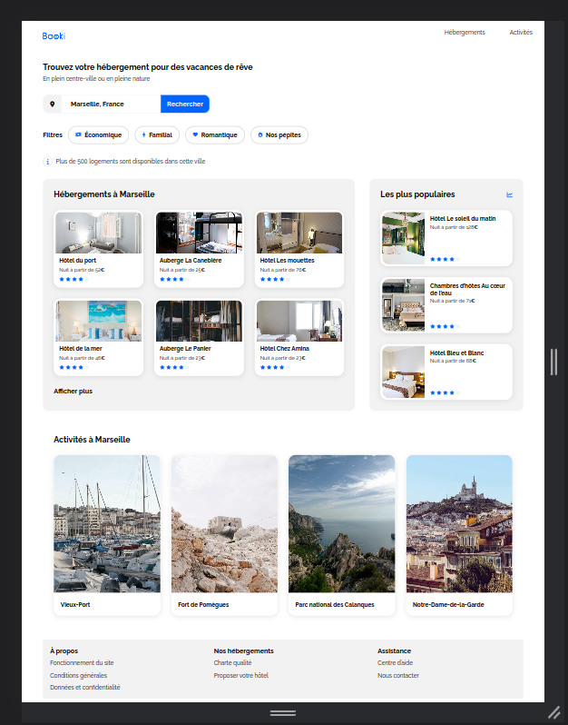

## Description

This project involves integrating a graphical mockup design into HTML and CSS code.

This includes :
- organizing the content semantically,
- applying appropriate visual styles,
- ensuring a responsive and optimized user experience,
- and making the site accessible to users with specific needs.

## Licences

* Fonts:

The license for Raleway font is a SIL OFL license.

* Pictures:

Florian Wehde, Kilyan Sockalingum, Paul Hermann, Reno Laithienne, Annie Spratt, Aw-creative, Emile Guillemot, Febrian Zakaria, Fred Kleber, Marcus Loke, Nicate Lee, Reisetopia.
